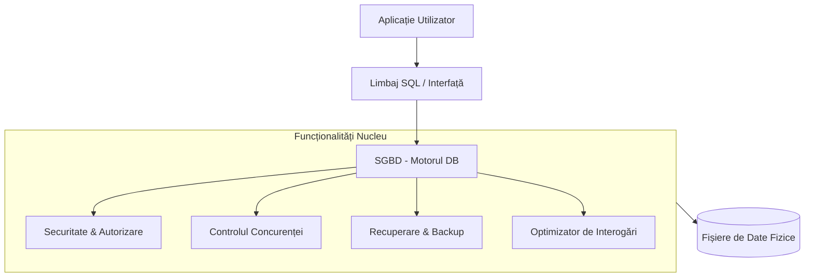

# Rolul Implementării Bazelor de Date   în Sistemele Informatice

  Apasă Spațiu pentru a începe <carbon:arrow-right />

  Grajdian Cristian

---
layout: intro
---

# Ce este un Sistem Informatic?

Un ansamblu organizat de resurse (hardware, software, date și oameni) destinat colectării, stocării și procesării datelor pentru a furniza informații necesare procesului de decizie.

<v-clicks>

- **Componenta Centrală**: Baza de date.
- **Scopul**: Transformarea fluxurilor de date brute în cunoaștere.
- **Eficiența**: Rapiditatea cu care putem accesa ceea ce avem nevoie.

</v-clicks>

---
layout: two-cols
---

# Date vs. Informație

Diferența fundamentală care stă la baza informaticii.

::left::

<h3 class="font-bold border-b-2 border-blue-500 mb-2">Date (Materie Primă)</h3>
<ul class="list-disc list-inside">
  <li v-click>Fapte brute, neprelucrate.</li>
  <li v-click>Exemple: 150, "Ion", 12.05.2023.</li>
  <li v-click>Nu au un înțeles implicit fără context.</li>
  <li v-click>Sunt greu de utilizat pentru decizii.</li>
</ul>

::right::

<h3 class="font-bold border-b-2 border-green-500 mb-2">Informație (Produs Finit)</h3>
<ul class="list-disc list-inside">
  <li v-click>Date procesate și organizate.</li>
  <li v-click>Exemple: "Stocul este de 150 unități", "Ion s-a angajat pe 12.05.2023".</li>
  <li v-click>Are context și relevanță.</li>
  <li v-click>Ajută direct în luarea deciziilor.</li>
</ul>

---
layout: center
class: text-center
---

# De la Haos la Ordine

Cum ne ajută baza de date să traducem datele în informație?

  

    <carbon:assembly-cluster class="text-4xl mb-2 mx-auto text-blue-500" />
    <h3 class="font-bold">Structură</h3>
    
Definește formatul și tipul datelor (nume, număr, dată).

  

  

    <carbon:connect class="text-4xl mb-2 mx-auto text-green-500" />
    <h3 class="font-bold">Relații</h3>
    
Leagă entitățile între ele (ex: Clientul X a cumpărat Produsul Y).

  

  

    <carbon:search class="text-4xl mb-2 mx-auto text-orange-500" />
    <h3 class="font-bold">Interogare</h3>
    
Permite extragerea rapidă a răspunsurilor prin limbaje precum SQL.

  

---
layout: image-right
image: https://picsum.photos/seed/coding/800/1200
---

# Putem lucra fără o bază de date?

**Teoretic, DA.** Putem folosi fișiere text sau binare.

<v-clicks>

- **Fișiere CSV**: Simple, dar limitate.
- **Logica în Aplicație**: Tu scrii tot codul de citire/scriere.
- **Stocare locală**: Greu de partajat între mai mulți utilizatori.

</v-clicks>

  <strong>Dar...</strong> este o cale plină de capcane tehnice care pot distruge un proiect serios.

---

# Provocarea 1: Căutare și Eficiență

Într-un sistem manual, căutarea seamănă cu răsfoirea unei biblioteci fără catalog.

  

    <h3 class="text-red-500 font-bold mb-2">Fără DB</h3>
    <ul class="text-sm list-disc">
      <li>Trebuie să citești tot fișierul de la început la sfârșit (Linear Scan).</li>
      <li>Performanța scade dramatic pe măsură ce datele cresc.</li>
      <li>Sortarea manuală consumă memorie și timp.</li>
    </ul>
  

  

    <h3 class="text-green-500 font-bold mb-2">Cu DB</h3>
    <ul class="text-sm list-disc">
      <li><strong>Indexare</strong>: Ca un index la sfârșitul unei cărți.</li>
      <li>Căutări instantanee prin structuri de tip B-Tree sau Hash.</li>
      <li>Optimizatorul de interogări alege cea mai rapidă cale.</li>
    </ul>
  

---

# Provocarea 2: Concurență și Integritate

Ce se întâmplă când doi utilizatori vor să modifice același lucru în același timp?

  

    <carbon:warning class="text-red-500 text-2xl flex-shrink-0" />
    

      <strong>Conflictul de Scriere:</strong> Fără un mecanism de "locking", ultima salvare o suprascrie pe prima, ducând la pierderi de date.
    

  

  
  

    <carbon:data-error class="text-orange-500 text-2xl flex-shrink-0" />
    

      <strong>Inconsistența:</strong> O eroare la jumătatea procesului poate lăsa datele "rupte" (ex: banii au plecat dintr-un cont, dar n-au ajuns în celălalt).
    

  

  

    <strong>Soluția DB: Proprietățile ACID</strong> (Atomicitate, Consistență, Izolare, Durabilitate) garantează că tranzacțiile sunt sigure și complete.
  

---
layout: two-cols
---

# Provocarea 3: Securitate și Redundanță

::left::

### Securitate
- Într-un sistem de fișiere, dacă ai acces la fișier, vezi tot.
- Bazele de date permit **Control Granular**:
  - Utilizatorul A poate doar citi.
  - Utilizatorul B poate modifica doar coloana "Preț".
  - Utilizatorul C nu vede datele medicale.

::right::

<h3>Redundanță și Backup</h3>
<ul class="list-disc">
  <li>Copiile manuale se învechesc repede.</li>
  <li>Bazele de date oferă:
    <ul class="list-circle ml-6">
      <li>Replicare în timp real.</li>
      <li>Point-in-time recovery.</li>
      <li>Eliminarea duplicatelor inutile (Normalizare).</li>
    </ul>
  </li>
</ul>

---
layout: center
---

# Arhitectura unui SGBD (DBMS)

Sistemul de Gestiune a Bazelor de Date este "scutul" și "creierul" datelor tale.

---

# Concluzii

Implementarea unei baze de date nu este doar o alegere tehnică, ci o necesitate strategică.

<v-clicks>

1.  **Scalabilitate**: Sistemul tău poate crește de la 100 la 100 de milioane de înregistrări.
2.  **Încredere**: Datele sunt protejate împotriva erorilor umane și tehnice.
3.  **Inteligență**: Transformi datele brute în informații care generează valoare.
4.  **Standardizare**: Folosești limbaje universale (precum SQL) înțelese de orice specialist.

</v-clicks>

  "O aplicație este la fel de bună ca datele pe care se bazează."

---
layout: end
---

# Mulțumesc!

Întrebări?

[Link către documentație](https://sli.dev)
